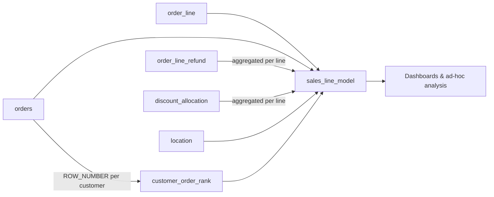
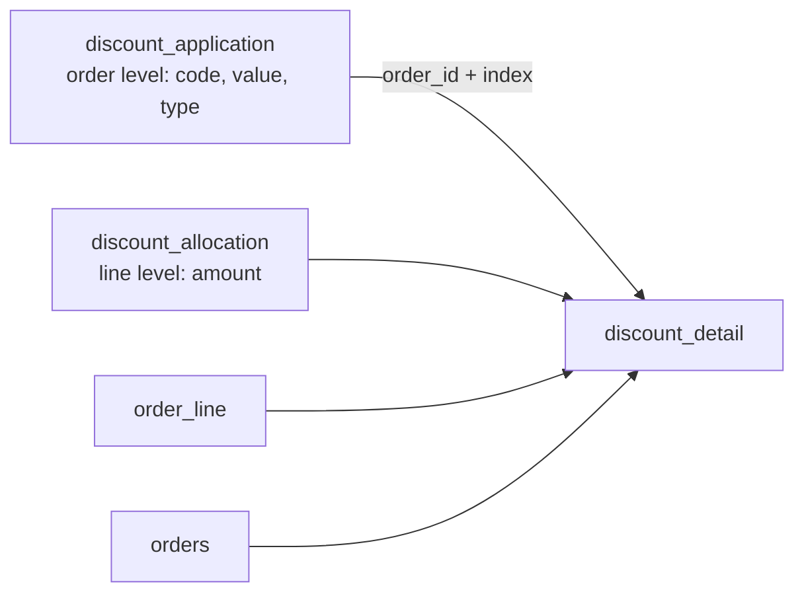
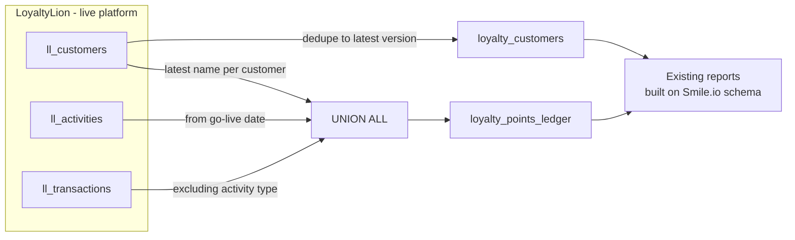

# Retail Analytics SQL Models (BigQuery)

SQL models I built as a Data Analyst for a multi-store fashion retailer,
turning raw e-commerce and loyalty-program data in BigQuery into clean
tables for reporting and analysis.

> Dataset names and internal codes are anonymized, and no company or
> customer data is included.

| Model | What it does | Source |
|---|---|---|
| [`sales_line_model.sql`](models/sales_line_model.sql) | Line-level gross, discount, return and net sales, plus first-time vs returning customer segmentation | Shopify via Fivetran |
| [`discount_detail.sql`](models/discount_detail.sql) | Every discount on every order line, with the code or campaign behind it | Shopify via Fivetran |
| [`loyalty_customers.sql`](models/loyalty_customers.sql) | Loyalty members, balances and status, rebuilt in the legacy reporting schema | LoyaltyLion |
| [`loyalty_points_ledger.sql`](models/loyalty_points_ledger.sql) | Full points history, rebuilt in the legacy reporting schema | LoyaltyLion |

---

## 1. Sales & Customer Retention Model

### Business problem

- Sales figures mixed gross and net values, so store and channel
  reports didn't reconcile
- Refunds and stacked discounts were double-counted when tables were
  joined directly
- The team couldn't separate **first-time** buyers from **returning**
  customers

### What the model does

| Area | Logic |
|---|---|
| Revenue | Gross sales, discounts, returns, net sales (before and after returns) |
| Quantity | Units sold, units refunded, net units |
| Dimensions | Store location, sales channel (web / mobile / POS), payment method |
| Customers | Purchase rank per customer → `First-time`, `Returning` or `Guest` |
| Data quality | Refunds and discounts pre-aggregated per order line to prevent row duplication |

**Grain:** one row per order line.



### Key design decisions

1. **Aggregate before joining.** An order line can have several refund
   rows and several discount allocations. Joining them raw multiplies
   rows and inflates sales, so both are summed per `order_line_id` first.
2. **Guests are handled separately.** Orders without a `customer_id`
   are labelled `Guest` instead of being ranked together as one customer.
3. **Deterministic ranking.** `ROW_NUMBER()` orders by `created_at` and
   then `id`, so orders placed at the same timestamp rank consistently.

---

## 2. Discount Detail

### Business problem

The sales model shows *how much* discount each order line received, but
not *which* discount. Marketing needed to see the cost and usage of each
voucher code and automatic promotion.

### What the model does

- Links each line-level discount amount to the order-level discount that
  created it (code, title, value, percentage or fixed)
- Names each discount by its voucher code, or by its title for
  automatic promotions
- Keeps one row per discount per line, so stacked discounts stay visible



### Key design decisions

1. **Understanding the source data model.** Shopify defines discounts at
   order level and allocates amounts at line level. The two are joined on
   `order_id` plus the application `index`.
2. **Row-count validation.** Output rows must equal allocation rows,
   which confirms the join doesn't duplicate or drop discounts.
3. **Reconciles with the sales model.** Total `discount_amount` here
   matches total `discount` in `sales_line_model`.

---

## 3. Loyalty Platform Switch (Smile.io → LoyaltyLion)

### Business problem

The business replaced its loyalty platform, closing Smile.io and moving
to LoyaltyLion. All existing loyalty reports and dashboards were built
on Smile.io's data structure, and LoyaltyLion stores the same
information very differently. Without a fix, every report would have
needed rebuilding, and history would be split across two platforms.

### What I built

A compatibility layer: two models that reshape LoyaltyLion data into the
legacy Smile.io schema, so existing reports keep working and old and new
data line up into one continuous history.

| Model | Grain | Contents |
|---|---|---|
| `loyalty_customers.sql` | 1 row per customer | Name, email, birthday, points balance, member status, VIP tier, referral link |
| `loyalty_points_ledger.sql` | 1 row per points movement | Earned points (activities) plus claimed rewards and adjustments (transactions) |



### Key design decisions

1. **Schema compatibility over rebuilding.** Matching the legacy column
   names, types and values meant dashboards kept running through the
   platform switch with no rework.
2. **Translating status between platforms.** LoyaltyLion's `enrolled`,
   `guest` and `blocked` flags are mapped to the legacy `member`,
   `candidate` and `blocked` states.
3. **Deduplicating incremental syncs.** Fivetran can land several
   versions of a customer. `QUALIFY ROW_NUMBER()` keeps the latest, with
   a sync timestamp as tie-breaker.
4. **No double counting in history.** Activity-type transactions are
   excluded, since those points already appear in the activities table.
5. **Traceable rows.** A `source_table` column shows where each ledger
   row came from, since ids can overlap between the two source tables.

---

## Repository structure

```
models/
  sales_line_model.sql        -- sales & customer retention model
  discount_detail.sql         -- discount breakdown by code / campaign
  loyalty_customers.sql       -- loyalty members & balances (legacy schema)
  loyalty_points_ledger.sql   -- loyalty points history (legacy schema)
analysis/
  example_queries.sql         -- monthly sales, customer mix, repeat-rate cohorts
```

## Impact

- [e.g. Became the main source for sales reporting across N stores and online]
- [e.g. Reduced manual reconciliation from X hours to Y minutes per week]
- [e.g. Tracked cost and usage of N voucher codes for marketing]
- [e.g. Kept N loyalty dashboards running through a platform switch with zero rebuilds]

## Tech

BigQuery Standard SQL · CTEs · window functions · QUALIFY · JSON parsing · UNION ALL · Fivetran · Shopify · LoyaltyLion · Smile.io · [Looker Studio / Power BI]
